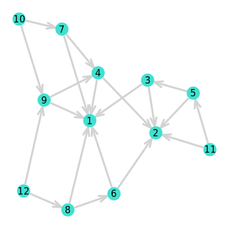

# DynaPlanning

[WIP] Reinforcement learning experiments (Dyna-Q+) using game theory (network routing games). A rather straight-forward/simple directed graph is used to assess the performance.

### Dependencies

[LightGraphs.jl](https://github.com/JuliaGraphs/LightGraphs.jl): `SimpleWeightedGraph` is the base graph type.  Algorithms such as *A** or the recursive depth-first search (DFS) are used.

[JuMP.jl](https://github.com/jump-dev/JuMP.jl): the linear programming (LP) optimization framework is used to solve a min-cost flow problem (optimal assignment).

### Unit tests
[Test.jl](https://docs.julialang.org/en/v1/stdlib/Test/) and [Logging.jl](https://docs.julialang.org/en/v1/stdlib/Logging/) modules are used for unit testing the code and output debug information. Run:

    julia maintest.jl

Code coverage is still missing.

### Why Julia?

There's a lot of back and forth on benchmarking Python, C++ and Julia. In my opinion, Python is probably the best scripting language for quick&dirty prototyping. When it comes to experimenting, MATLAB is my preferred option. However, as everyone claims, Julia lies in between Python and the gold standard for high performance computing, C++.

When I was thinking about doing an abstraction of the problem, I realized Julia was:

 - more handy,
 - easy-to-interpret,
 - as abstract-rich as a pure OOP language, and
 - with a very nice LaTeX typesetting/interpreter in Atom.

---
## References
<a id="1">[1]</a>
Roughgarden, T. (2004). Stackelberg scheduling strategies. SIAM journal on computing, 33(2), 332-350.

<a id="1">[2]</a>
Sutton, R. S., & Barto, A. G. (2018). Reinforcement learning: An introduction. MIT press.

<a id="1">[3]</a>
Kwon, C. (2016). Julia programming for operations research: a primer on computing.
